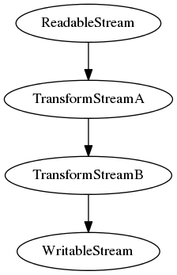
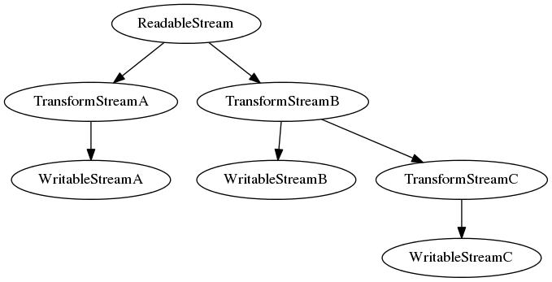

# stream-stats-reporter

Report statistics for nodejs stream.

## Dependencies

Node.js 6 or higher

## Usage

### straight stream



#### Code

```javascript
const Reporter = require("stream-stats-repoter");

const reporter = new Reporter();
const stream = new ReadableStream();
stream.pipe(new TransformStreamA())
  .pipe(new TransformStreamB())
  .pipe(new WritableStream)
  .on("finish", () => {
    console.log(JSON.stringify(reporter.stats(), null, 2));
  });
reporter.register(stream);
```

#### Output

```json
[
  {
    "name": "ReadableStream",
    "layer": 1,
    "index": 0,
    "path": [0],
    "stats": {
      "min": 0,
      "max": 13,
      "sum": 518,
      "count": 100,
      "mean": 5.18,
      "stddev": 2.91334858882352
    }
  },
  {
    "name": "TransformStreamA",
    "layer": 2,
    "index": 0,
    "path": [0, 0],
    "stats": {
      "min": 0,
      "max": 10,
      "sum": 521,
      "count": 100,
      "mean": 5.21,
      "stddev": 2.91991438230644
    }
  },
  {
    "name": "TransformStreamB",
    "layer": 3,
    "index": 0,
    "path": [0, 0, 0],
    "stats": {
      "min": 0,
      "max": 11,
      "sum": 457,
      "count": 100,
      "mean": 4.57,
      "stddev": 2.8574639105332555
    }
  },
  {
    "name": "WritableStream",
    "layer": 4,
    "index": 0,
    "path": [0, 0, 0, 0],
    "stats": {
      "min": 0,
      "max": 10,
      "sum": 525,
      "count": 100,
      "mean": 5.25,
      "stddev": 2.692118125194361
    }
  }
]
```

### forked stream



#### Code

```js
const Reporter = require("stream-stats-repoter");
const reporter = new Reporter();
const stream = new ReadableStream();

const p1 = new Promise((resolve) => {
    stream.pipe(new TransformStreamA())
        .pipe(new WritableStreamA)
        .on("finish", () => {
            resolve();
        });
});

const p2 = new Promise((resolve) => {
    const s2 = stream.pipe(new TransformStreamB())
        .pipe(new TransformStreamB());
    const p21 = new Promise((resolve) => {
        s2.pipe(new WritableStreamB)
            .on("finish", () => {
                resolve();
            });
    });
    const p22 = new Promise((resolve) => {
        s2.pipe(new TransformStreamC)
            .pipe(new WritableStreamC)
            .on("finish", () => {
                resolve();
            });
    });
    return Promise.all([p21, p22]).then(() => {
        resolve();
    });
});

reporter.register(stream);
Promise.all([p1, p2]).then(() => {
    console.log(JSON.stringify(reporter.stats(), null, 2));
});
```

#### Output

```json
[
  {
    "name": "ReadableStream",
    "layer": 1,
    "index": 0,
    "path": [0],
    "stats": {
      "min": 0,
      "max": 14,
      "sum": 524,
      "count": 100,
      "mean": 5.24,
      "stddev": 2.7390509305231983
    }
  },
  {
    "name": "TransformStreamA",
    "layer": 2,
    "index": 0,
    "path": [0, 0],
    "stats": {
      "min": 0,
      "max": 11,
      "sum": 499,
      "count": 100,
      "mean": 4.99,
      "stddev": 2.9782377339628217
    }
  },
  {
    "name": "WritableStreamA",
    "layer": 3,
    "index": 0,
    "path": [0, 0, 0],
    "stats": {
      "min": 0,
      "max": 10,
      "sum": 499,
      "count": 100,
      "mean": 4.99,
      "stddev": 2.971514765233383
    }
  },
  {
    "name": "TransformStreamB",
    "layer": 2,
    "index": 1,
    "path": [0, 1],
    "stats": {
      "min": 0,
      "max": 11,
      "sum": 500,
      "count": 100,
      "mean": 5,
      "stddev": 2.949576240750525
    }
  },
  {
    "name": "TransformStreamB",
    "layer": 3,
    "index": 0,
    "path": [0, 1, 0],
    "stats": {
      "min": 0,
      "max": 10,
      "sum": 434,
      "count": 100,
      "mean": 4.34,
      "stddev": 2.8503333138424356
    }
  },
  {
    "name": "WritableStreamB",
    "layer": 4,
    "index": 0,
    "path": [0, 1, 0, 0],
    "stats": {
      "min": 0,
      "max": 10,
      "sum": 493,
      "count": 100,
      "mean": 4.93,
      "stddev": 2.815155413116654
    }
  },
  {
    "name": "TransformStreamC",
    "layer": 4,
    "index": 1,
    "path": [0, 1, 0, 1],
    "stats": {
      "min": 0,
      "max": 10,
      "sum": 486,
      "count": 100,
      "mean": 4.86,
      "stddev": 2.5417316931572462
    }
  },
  {
    "name": "WritableStreamC",
    "layer": 5,
    "index": 0,
    "path": [0, 1, 0, 1, 0],
    "stats": {
      "min": 0,
      "max": 10,
      "sum": 501,
      "count": 100,
      "mean": 5.01,
      "stddev": 2.6888473366853685
    }
  }
]
```
